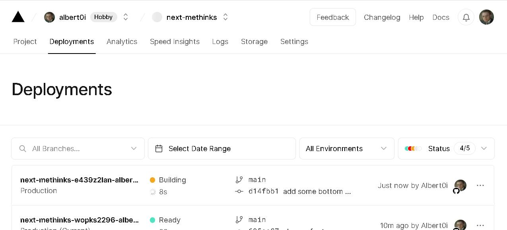

# Test.md 

### Relative image path

if you see the above image, that means *reBaseImageUrl* works as expected. 

### Absolute image path 

if you can't see the above image, that means *reBaseImageUrl* doesn't work and try changing *_rebaseimg=false*. 

